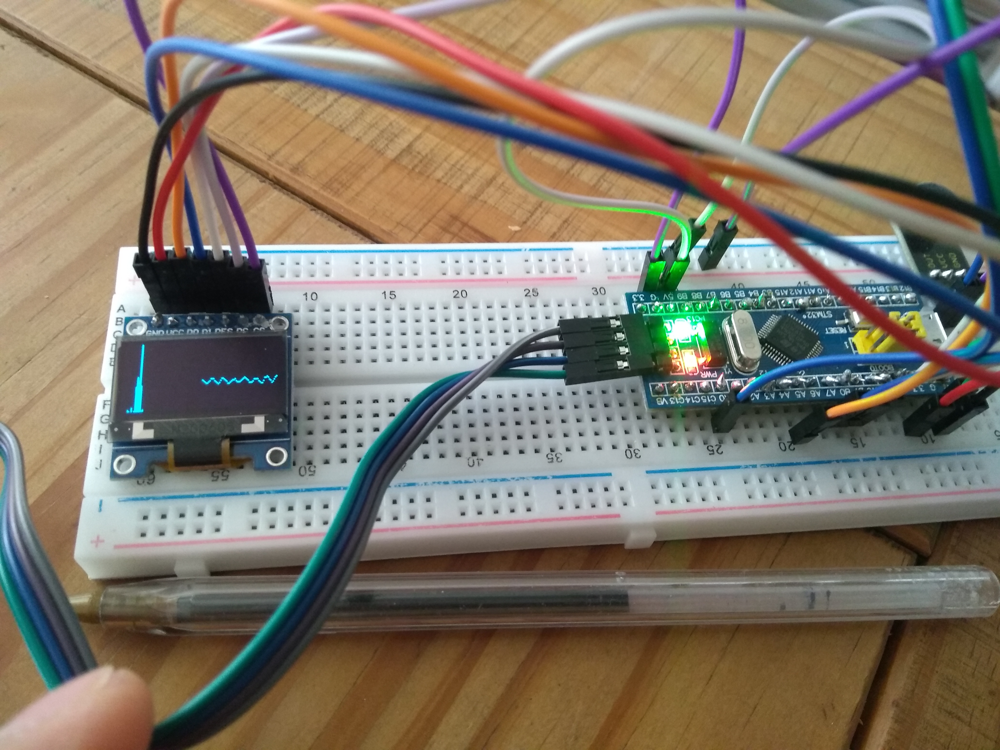

write:
cargo flash --chip stm32f103C8 --releases

debug:
openocd -f interface/stlink-v2.cfg -f target/stm32f1x.cfg

gdb-multiarch target/thumbv7m-none-eabi/debug/rusty-blink

depois

target remote :3333
load
monitor arm semihosting enable
break main
continue

Ou, usando config:

gdb-multiarch -x openocd.gdb target/thumbv7m-none-eabi/debug/rusty-blink

ou

./flashDebug.sh

Apenas build + upload, sem debug:

cargo build --release;cargo flash --chip stm32f103C8 --release

